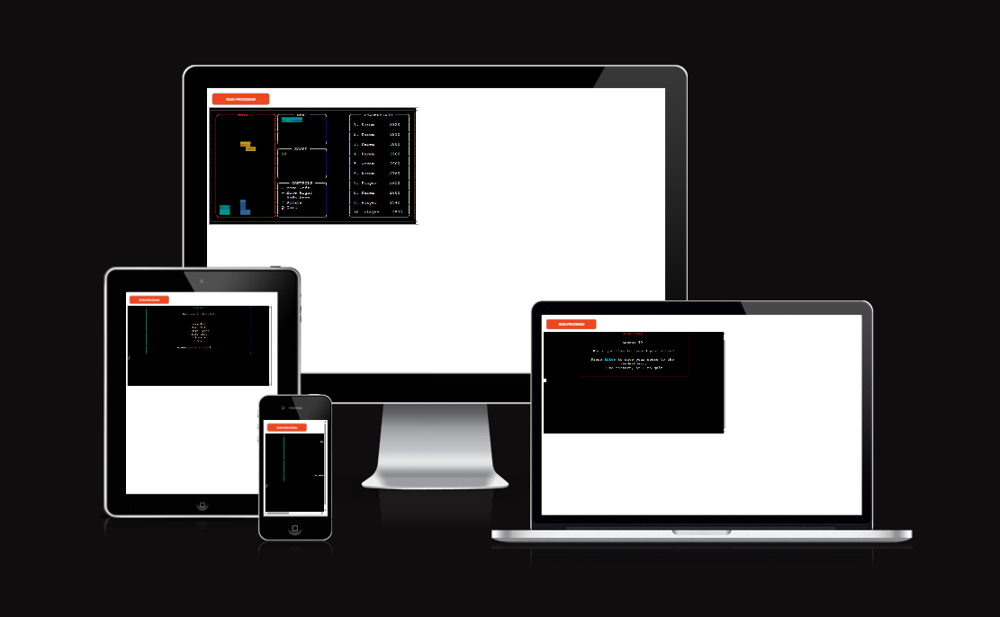
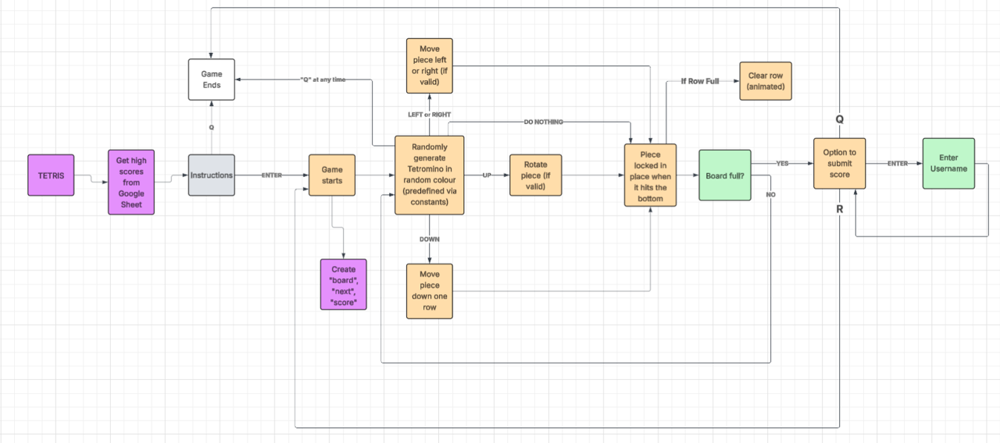

# Terminal Tetris



*A link to [play Terminal Tetris on Heroku](https://tetris-kh-c29675af7f73.herokuapp.com/)*

Terminal Tetris is a Python-based reimagining of the classic arcade game, designed to run entirely within the terminal.

The game uses the [Rich](https://github.com/Textualize/rich) library to enhance the interface with colorful emoji blocks and live score tracking. It also utilizes [Blessed](https://pypi.org/project/blessed/) for handling keypresses and terminal behavior, and [Prompt Toolkit](https://python-prompt-toolkit.readthedocs.io/en/master/) to manage input for features like the leaderboard.

Despite the absence of a graphical window, the game remains engaging, responsive, and faithful to the spirit of the original.

## How to Play

1. Click this [link to Terminal Tetris](https://tetris-kh-c29675af7f73.herokuapp.com/) or paste it into your browser.
2. Click **“Run Program”** to start the game in the terminal.
3. Press **Enter** to begin.
4. Use the following controls to play:

   - **←** Move Left
   - **→** Move Right
   - **↓** Soft Drop
   - **↑** Rotate
   - **Q** Quit the Game
   - **R** Restart the Game
   - **Enter** Submit Score (after game over, as well as various other functionalities)

5. As blocks fall, try to fill horizontal lines to clear them and earn points.
6. The game ends when the board is full and new pieces can’t spawn.
7. After the game, you’ll be prompted to enter a name for the leaderboard (max 10 characters).
8. You can restart the game, quit, or save your score, as well as view the leaderboard!

## User Stories

### First-Time Visitor Goals

- As a First-Time Visitor, I want to understand the game's purpose quickly so that I know what I’m about to play.
- As a First-Time Visitor, I want to see clear instructions and controls so that I can learn how to play easily.
- As a First-Time Visitor, I want the terminal interface to be visually appealing so that the experience is fun and engaging.
- As a First-Time Visitor, I want to be able to submit my score so that I feel rewarded for my performance.

### Returning User Goals

- As a Returning User, I want the controls to feel intuitive and responsive so that I can improve my gameplay.
- As a Returning User, I want to be able to restart the game quickly so that I can try to beat my high score.
- As a Returning User, I want to view and submit my name to the leaderboard so that I can track my progress over time.


## Features

### Welcome Screen

- When the game launches, users are greeted with a colorful welcome screen rendered using the Rich library.
- Instructions and controls are displayed clearly with styled arrow keys and color-coded options.


---

### Game Interface

- The game board is drawn entirely in the terminal using colored emoji blocks (e.g., 🟥, 🟦) for a vibrant and engaging experience.
- The layout is designed to render correctly on **Heroku’s terminal emulator**, even with its limited emoji/font support.
- The game detects the operating system and terminal type:
  - **If running locally** (on Windows or macOS with full emoji support), emoji blocks like 🟥 are used.
  - **If running on Heroku**, it falls back to alternative block characters (e.g., `▓`) to ensure full compatibility.
- Tetrominoes fall from the top of the board and can be moved or rotated using the arrow keys.
- Real-time rendering is handled with `blessed`, keeping the experience smooth and responsive.


---

### Score Tracking

- The current score is displayed on the side of the board.
- The game tracks cleared lines and increases the score accordingly.
- The score updates live as you play.


---

### Tetromino Preview (Optional)

- The next tetromino is previewed next to the game board to help players plan ahead.
- Each shape has its own color, making them easier to distinguish.


---

### Leaderboard Input

- When the game ends, players are prompted to enter a name (max 10 characters).
- Input is handled using `prompt_toolkit` for clean, styled input.
- Players can skip this step or save their score to a leaderboard.


---

### Game Over & Options

- After the game ends, users can:
  - Submit their score
  - Restart the game
  - Quit the application
- The game handles invalid input and gently guides the user to make a selection.


## Flowchart

The following flowchart represents the core logic of the Terminal Tetris application, from initial launch to game over and score submission.

It illustrates how the game interacts with user input (movement, rotation, quit), score updates, row clearing, and end-game options like restarting or submitting to the leaderboard.




## Class Design: `Piece` and `MaxLengthValidator`

### `Piece` Class (in `piece.py`)

The `Piece` class represents a falling Tetris piece (Tetromino). It encapsulates all logic related to its shape, position, and rotation:

- `shape_name`: The identifier for the piece type (e.g. "T", "L", etc.).
- `shape`: A 2D list representing the block layout.
- `emoji`: The character used to draw the piece (emoji or block, depending on terminal compatibility).
- `row`, `col`: The current position of the piece on the board.

#### Key Method Highlights:

- **`get_coords()`**  
  Calculates and returns the piece’s occupied positions on the board.

- **`rotate(board)`**  
  Attempts to rotate the piece clockwise. The rotation is only applied if it doesn’t result in a collision or out-of-bounds error.

- The class is used alongside a helper function `new_random_piece()` to spawn a new piece with a random shape and emoji color.

---

### `MaxLengthValidator` Class (in `game_logic.py`)

This class inherits from `prompt_toolkit.validation.Validator` and ensures that leaderboard names are no longer than 10 characters.

- It checks the input string length and raises a `ValidationError` if the limit is exceeded.
- This class enhances user experience by providing immediate and styled feedback within the terminal input field.

---

## Architecture & Module Justification

The project follows a modular architecture, where each Python file handles a specific responsibility. This separation ensures maintainability, clarity, and alignment with OOP and clean code principles.

### Module Overview

- **`run.py`**  
  The main entry point of the program. It calls the welcome screen and then starts the game loop. This keeps startup logic clean and isolated from the gameplay code.

- **`game_logic.py`**  
  This is the central hub of the gameplay. It manages the core loop, user inputs, piece updates, rendering coordination, and game state transitions (e.g., game over, restarting, saving scores).  
  It also includes the `MaxLengthValidator` class for limiting leaderboard name input.

- **`piece.py`**  
  Contains the `Piece` class, which models each Tetromino's position, shape, rotation, and appearance.  
  Includes `new_random_piece()` to spawn a random piece using data from the `constants` module.

- **`board.py`**  
  Manages the game board — a 2D grid of cells. Provides functions to:
  - Check valid movement (`can_move`)
  - Lock pieces to the board (`lock_piece`)
  - Render temporary positions (`add_piece_to_board`)
  - Animate and clear completed lines (`clear_lines`)

- **`user_interface.py`**  
  Handles all terminal output using `rich` and `blessed`. This includes:
  - The welcome screen
  - Drawing the game board and next piece
  - Creating side panels for score and controls
  It keeps all visual logic separated from game logic.

- **`highscores.py`**  
  Manages all leaderboard functionality via `gspread` and Google Sheets:
  - Fetches and formats high scores (single or dual-column display)
  - Submits a new score when a user enters their name after the game
  All spreadsheet access and formatting are neatly encapsulated in this file.

- **`constants.py`**  
  Centralizes all constants and configuration:
  - Board dimensions and game speed
  - Tetromino shapes and block styles
  - Emoji vs fallback blocks (adjusted via `IS_HEROKU` environment variable)
  - Valid input keys for gameplay
  This file helps make the game configurable and Heroku-compatible without cluttering logic files.

---

This structure allows each module to focus on a single task:

- **Gameplay logic** stays in `game_logic.py`.
- **UI rendering** is managed entirely by `user_interface.py`.
- **Board and piece management** are abstracted into `board.py` and `piece.py`.
- **Persistent data (scores)** is handled in `highscores.py`.

This not only improves clarity and testability but also makes the project scalable — for example, adding a new piece type, UI enhancement, or leaderboard feature can be done without disrupting the entire codebase.

Overall, the architecture supports a clean development workflow, real-time terminal gameplay, and deployability to cloud platforms like Heroku.


## Technologies Used

### Languages

- [Python 3](https://www.python.org/): Main programming language used to build the game logic and terminal interface.
- [JavaScript](https://developer.mozilla.org/en-US/docs/Web/JavaScript): Required for Heroku’s terminal emulation (via Code Institute’s mock terminal setup).
- [HTML](https://developer.mozilla.org/en-US/docs/Web/HTML): Used in the deployed environment for the terminal interface wrapper.

### Python Libraries and Modules

#### Standard Library Imports

- `random`: Used for selecting random Tetromino shapes and colors.
- `time`: Used to control game speed and frame timing.
- `os`: Used to detect the platform (Heroku vs. local) and adjust rendering accordingly.
- `copy` — to create deep copies of the board for safe rendering without mutating the game state.
- `sys` — to cleanly exit the program when the user chooses to quit.

#### Third-Party Libraries

- [rich](https://github.com/Textualize/rich): Used for colorful terminal output, block styling, and visual UI elements (e.g., score, instructions).
- [blessed](https://pypi.org/project/blessed/): Handles real-time keyboard input and terminal screen updates.
- [prompt_toolkit](https://python-prompt-toolkit.readthedocs.io/en/master/): Used for styled and user-friendly input when entering usernames for the leaderboard.
- [gspread](https://docs.gspread.org/): Connects to Google Sheets for saving and retrieving leaderboard scores.
- [google-auth](https://pypi.org/project/google-auth/): Handles authentication to securely access Google Sheets.

### Tools

- [VS Code](https://code.visualstudio.com/): Used for writing, testing, and organizing code.
- [GitHub](https://github.com/): Hosted the project repository and deployment pipeline. Used for version control.

### Deployment

- [Heroku](https://heroku.com): Used to deploy the terminal-based application online, allowing users to play directly in the browser.
- [draw.io](https://draw.io) / [Lucidchart](https://www.lucidchart.com/): Used to create the flowchart included in the README.


## Future Features

- **Pause & Resume**: Add the ability to pause gameplay and resume mid-session.
- **Custom Key Bindings**: Let users remap controls to suit their preferences.
- **Ending**: Tetris famously includes an "End", but this version goes on without a set endpoint.
- **Position in Leaderboard**: When the game is over, the user is shown where they rank in all scores.
- **Animated Title Screen**: Make the welcome screen more dynamic using Rich's animation features.


## Bugs

### Solved Bugs

1. **Heroku Compatibility with Emoji Rendering**
   - **Issue:** Emoji blocks (🟥, 🟦, etc.) rendered incorrectly in the Heroku terminal.
   - **Solution:** Used `os.name` and platform detection to switch to simpler characters (like `▓`) when running on Heroku.

2. **Username Input Too Long**
   - **Issue:** Users could enter more than 10 characters for leaderboard names.
   - **Solution:** Input is now programmatically truncated to 10 characters. A visual warning informs users of the limit.

3. **Duplicate Game Over Trigger**
   - **Issue:** The game over logic was firing more than once, causing visual or logical glitches in score submission.
   - **Solution:** Added a safeguard to ensure the game over sequence can only be triggered once per session.

4. **Unintended Key ("4") Was Speeding Up the Piece**
   - **Issue:** Pressing certain number keys (e.g., "4") unintentionally triggered downward movement.
   - **Solution:** Implemented a strict `VALID_KEYS` check to ignore all unintended input and only respond to defined arrow keys.

5. **Leaderboard Input Misalignment**
   - **Issue:** User input for the leaderboard was not well-aligned or styled on different terminal sizes.
   - **Solution:** Replaced basic input with `prompt_toolkit` for consistent, styled, and center-aligned user prompts.

### Unsolved Bugs

- **Piece movement speeds up when holding left or right**
  - **Issue:** Holding the left or right arrow key increases the falling speed of the current piece, similar to holding the down arrow.
  - **Reason for not fixing:** This behavior is due to how key events are handled in the terminal. Fixing it would require complex asynchronous input tracking or threading, which is not justified for the scope of this project. It doesn't break the game and is minor in gameplay impact.


## Testing

Please refer to the [TESTING.md](TESTING.md) file for detailed testing and validation documentation.


## Deployment

### Live Deployment (Heroku)

Terminal Tetris is deployed using [Heroku](https://heroku.com/) with the Code Institute Python template.

You can play the game here:  
[https://tetris-kh-c29675af7f73.herokuapp.com/](https://tetris-kh-c29675af7f73.herokuapp.com/)

### Steps to Deploy on Heroku

1. Fork or clone the repository from GitHub.
2. Create a new app on [Heroku Dashboard](https://dashboard.heroku.com/).
3. In the **Deploy** tab:
   - Connect your Heroku app to your GitHub repository.
   - Enable **automatic deploys** or click **"Deploy Branch"** manually.

4. In the **Settings** tab:
   - Click **“Reveal Config Vars”** and add the following:
     - `PORT` → `8000`
     - `GOOGLE_SHEETS_CREDS` → *Your base64-encoded credentials or a JSON string as required by gspread*

5. Still under **Settings**, add the following **buildpacks** in this order:
   - `heroku/python`
   - `heroku/nodejs`

6. Make sure the following files exist in your repo root:
   - `run.py`
   - `requirements.txt`
   - `Procfile`
   - `runtime.txt`

7. Once deployed, click **"Open App"** to launch the terminal interface in your browser.

---

### Run Locally

To run Terminal Tetris locally:

1. Ensure you have Python 3 installed:
    ```bash
   python3 --version

2. Clone the repository:
    ```bash
    git clone https://github.com/your-username/terminal-tetris.git
    cd terminal-tetris

3. (Optional) Create and activate a virtual environment:
    ```bash
    python3 -m venv venv
    source venv/bin/activate  # On Windows: venv\Scripts\activate

4. Install the dependencies:
    ```bash
    pip install -r requirements.txt

5. Set up Google Sheets credentials:
    - Provide a valid creds.json file or use an environment variable                (GOOGLE_SHEETS_CREDS) for access.
    - If running locally, place your credentials file in the project directory as creds.json.

6. Run the game:
    ```bash
    python run.py


## Credits

### Libraries & Tools

- [Rich (Textualize)](https://rich.readthedocs.io/en/stable/) — for styled terminal output, panels, and text formatting.
- [Blessed](https://blessed.readthedocs.io/en/latest/) — for real-time key detection and terminal control handling.
- [Prompt Toolkit](https://python-prompt-toolkit.readthedocs.io/en/master/) — for interactive, validated text input.
- [Gspread](https://docs.gspread.org/) — for accessing and modifying Google Sheets via API.
- [Google Auth (google-auth)](https://googleapis.github.io/google-auth-library-python/latest/) — for secure authentication with Google services.

### Educational Resources

- [Code Institute](https://codeinstitute.net/) — for the deployment boilerplate and course structure.
- [Textualize Blog](https://www.textualize.io/blog/) — for examples and insights into terminal UI design with Rich.
- [YouTube](https://www.youtube.com/) — for tutorials related to Python game development, terminal UX, and various dependencies.

### Acknowledgements

- Thanks to peer testers who provided feedback across Windows, macOS, and Heroku platforms.
- Special appreciation to the open-source community whose tools and documentation made this project possible.
- A special thanks to my Mentor [Iuliia Konovalova](https://github.com/IuliiaKonovalova), for the guidance throughout this project, as well as reminding me to follow best practices!
- The Google Sheets authentication code structure in `highscores.py` was adapted from the Code Institute "Love Sandwiches" walkthrough project.
