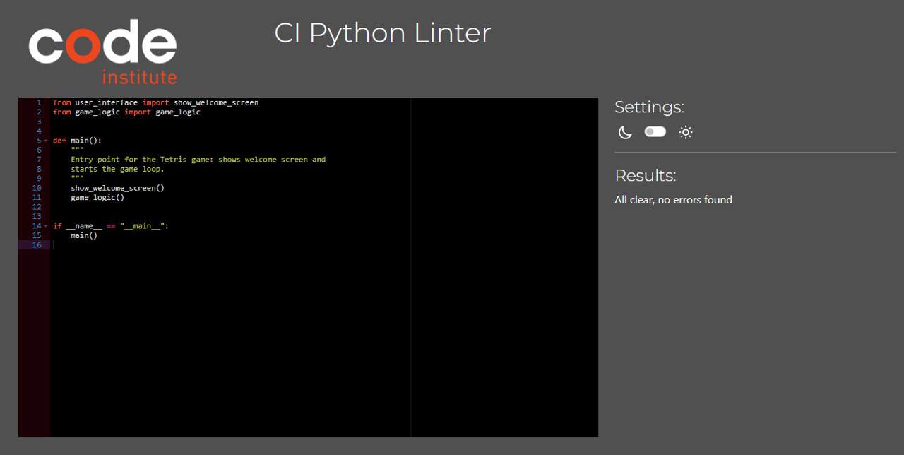
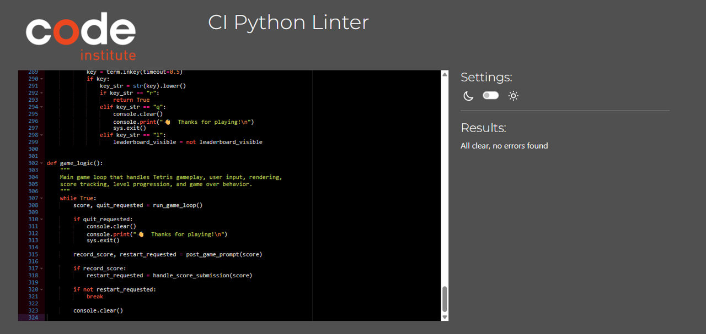
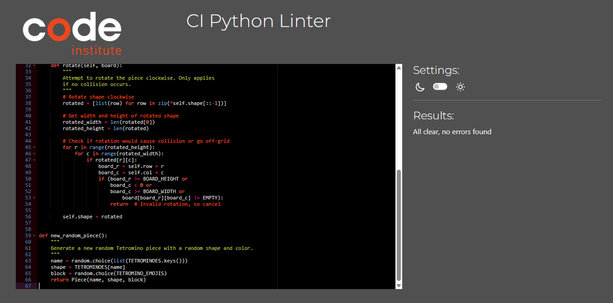
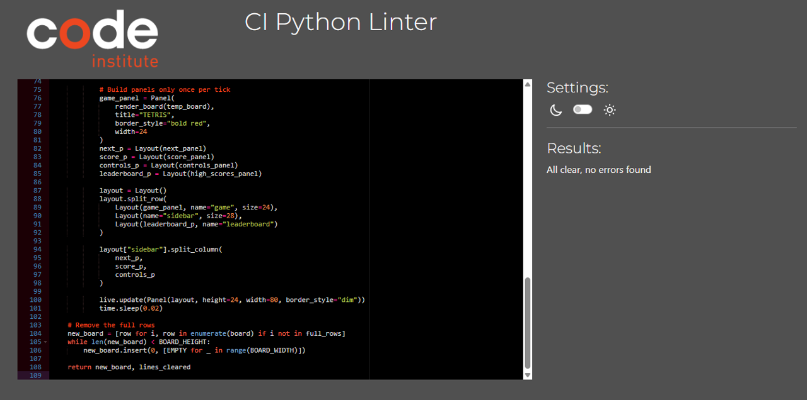
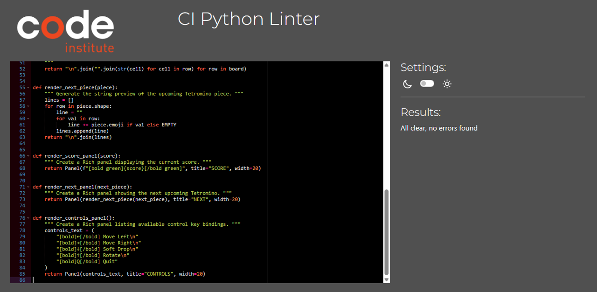
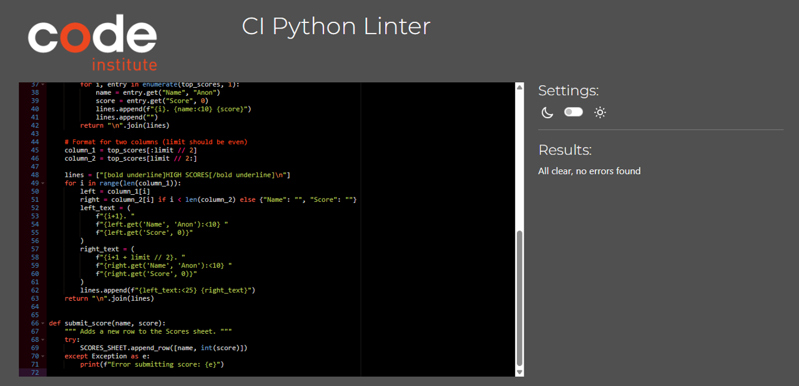
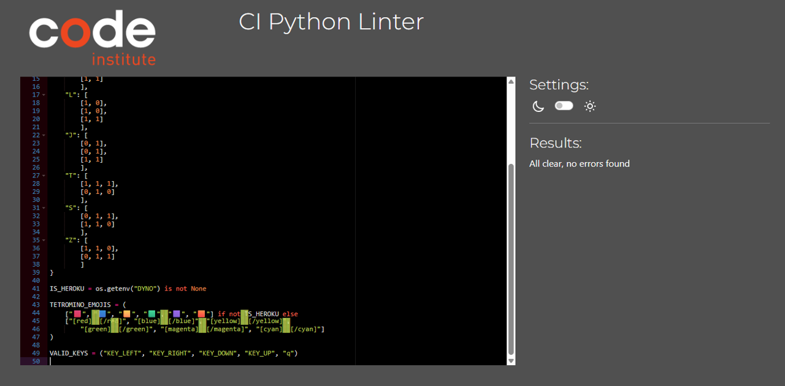

# Testing

Return back to the [README.md](README.md) file.

## Testing Overview

The Terminal Tetris game was tested continuously throughout development, both manually and with help from external users. These tests focused on gameplay functionality, terminal compatibility, user input, scoring, and leaderboard submission. Special care was taken to ensure visual consistency across platforms — especially between local terminals and Heroku’s hosted terminal emulator.

---

## Manual Testing

### Core Gameplay

- Game starts with a welcome screen and waits for user input.
- All controls work as expected:
  - Arrow keys move and rotate tetrominoes.
  - `Q` quits the game cleanly at any time.
  - Down arrow triggers soft drop (faster fall).
- Tetrominoes lock when reaching the bottom or landing on another block.
- Full rows are detected and cleared correctly, with animated wiping effect.
- Score increments as expected (10 per piece placed, 100 per line cleared).
- Level progression triggers every 5 cleared lines, increasing speed.
- Game over triggers only once, even under simultaneous conditions.
- Users can choose to restart, quit, view the leaderboard, or submit their score.

### Visual & UX Testing

- Emoji blocks render correctly in local terminals.
- On Heroku, block characters fall back to `▓▓` style with color markup using `rich`.
- Score and side panels update live.
- Leaderboard input is limited to 10 characters.
- A clear validation warning appears when name length is exceeded.
- Controls panel is always visible for easy reference.

---

## Peer/User Testing

The game was tested by several peers on the following platforms:

- **Windows 10 / 11** (PowerShell and Command Prompt)
- **macOS Terminal**
- **Heroku terminal emulator**

### Feedback Summary

- Users found controls intuitive and responsive.
- Emoji fallback worked as expected on Heroku.
- Restart and quit options were praised for being quick and accessible.
- The leaderboard feature was smooth and felt rewarding.
- No major bugs were encountered during external testing.

---

## Validators

All source code was checked using [PEP8 Online Validator](https://pep8ci.herokuapp.com/) to ensure full compliance with PEP 8 guidelines.

Each module was copy-pasted manually into the validator. No errors were found in any file.

Screenshots were taken to demonstrate both the successful validation **and** the presence of the required blank line at the end of each file (to address potential false warnings about missing EOF newlines).

### Validation Results

- **run.py**  
  

- **game_logic.py**  
  

- **piece.py**  
  

- **board.py**  
  

- **user_interface.py**  
  

- **highscores.py**  
  

- **constants.py**  
  
